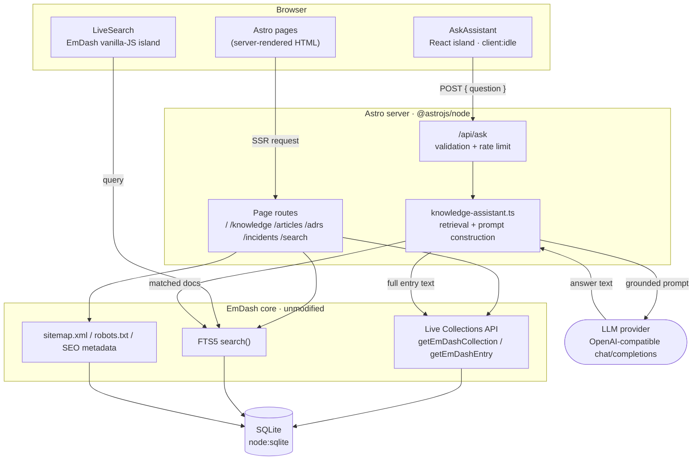

# EngiVault

EngiVault is an AI-augmented engineering knowledge hub — a public site for articles, architecture decision records, and incident postmortems, with full-text search and a retrieval-grounded AI assistant that answers engineering questions by citing the underlying documents. It is built as an additive consumer application on top of [EmDash](../../README.md), the Astro-native CMS that lives in this monorepo, rather than as a bespoke content platform: EmDash's schema registry, Live Collections API, and FTS5 search do the content and search work, and this project's own code is limited to presentation, retrieval-augmented generation, and the glue between the two.

## Problem

Engineering knowledge — architecture rationale, incident postmortems, internal guides — accumulates across wikis, chat threads, and tribal memory, and decays the moment the people who wrote it move on. Two failures show up repeatedly on real teams: the knowledge exists but isn't found (search is an afterthought, or the right document is three folders deep in a wiki nobody browses), and the knowledge is found but not trusted (a Slack thread or an outdated doc gets treated as ground truth with no way to verify it against the source). A generic chatbot layered on top makes this worse, not better, if it answers confidently from its own training data instead of the organization's actual documented decisions.

## Solution

EngiVault centralizes articles, ADRs, and incident reports in one schema, indexes them with real full-text search, and adds an AI assistant that is retrieval-grounded by construction: every answer is built exclusively from documents the search layer actually returned for that question, every source cited is a document that was actually retrieved (never one the model merely mentions), and the assistant says so explicitly when nothing relevant was found rather than guessing. The result is a knowledge base an engineer can search directly, or ask a question of in plain English and get an answer they can verify against the linked source — without the organization having to run a vector database, an embedding pipeline, or a second content system alongside the CMS it already has.

## Technology

- **TypeScript** — the language for all application code, including Astro component frontmatter, the AI retrieval/prompt logic, and tests
- **Astro** — server-rendered pages and routing (`output: "server"`, `@astrojs/node` adapter)
- **React** — a single interactive island (the AI assistant); everything else is plain Astro/HTML
- **EmDash** — the CMS this site is built on: schema-driven content model, Live Collections API, FTS5 search, taxonomies, SEO metadata, sitemap/robots
- **Node.js** — the runtime (≥22.16, for the built-in `node:sqlite` driver)
- **SQLite** (via Node's built-in `node:sqlite`, through EmDash's Kysely-based query layer) — the database
- **An OpenAI-compatible LLM provider** — any `chat/completions` API; defaults to Google Gemini's OpenAI-compatibility endpoint, swappable via env vars with no code change

## Architecture



## Core Features

- **Knowledge management** — three content types (articles, ADRs, incidents) as real EmDash collections, editable through EmDash's own admin UI, with drafts and revisions
- **Articles** — engineering guides and write-ups, with authorship, tags, and a featured flag
- **ADRs** — architecture decision records with structured problem/decision/alternatives/consequences fields and a status lifecycle (proposed → accepted → deprecated/superseded)
- **Incidents** — postmortems with severity, status, root cause, resolution, and lessons learned
- **Search** — FTS5-backed full-text search across all three types, with type filtering and a taxonomy-tag fallback for queries that name a tag rather than matching document text
- **AI Knowledge Assistant** — a natural-language Q&A interface at `/ask`, grounded in retrieved content, with loading/error/empty states
- **Source citations** — every AI answer lists the specific documents it drew from, each linking back to the original article/ADR/incident

## Architectural Decisions

The full ADRs, with context and alternatives considered, are documented in the running app at `/architecture/decisions`. Summarized:

1. **EmDash as the CMS foundation.** Content types are declared through EmDash's seed format and materialize as real SQL tables via its schema registry, rather than hand-rolling a content model, admin UI, and auth inside the assignment's time box.
2. **Astro server rendering, not static generation.** Every page queries EmDash's Live Collections API per request, so content published or edited through the admin appears immediately with no rebuild step.
3. **React islands, not a React SPA.** Astro components handle every page's static structure; React mounts only for the AI assistant and EmDash's own search island. No page ships a client-rendered React tree.
4. **The LLM call stays server-side.** The React island only ever calls this site's own `/api/ask`; the API key is read via `process.env` inside that route and never reaches the browser.
5. **FTS5 retrieval instead of a vector database.** At the content volume this knowledge base actually has, an embedding pipeline and a second data store would add real operational cost for no measurable retrieval-quality gain; EmDash's existing search covers it.

## Rendering Strategy

The site runs in Astro's `server` output mode on the `@astrojs/node` adapter — every route is server-rendered per request against the live database, not statically generated at build time, because content changes after deploy through the CMS admin and a static build would need a full rebuild on every edit. Almost the entire UI is plain Astro: static markup, scoped CSS, zero framework JavaScript shipped to the browser. Two things need real client-side interactivity — the header's live-search dropdown (EmDash's own `LiveSearch`, which is vanilla JS with no framework runtime at all) and the AI assistant's ask/answer flow, which is a single React island (`AskAssistant`) hydrated with `client:idle` so it attaches once the main thread is free rather than competing with initial page load. Every other page on the site ships no React runtime whatsoever.

## AI Architecture

The assistant follows a retrieval → context → LLM → sources pipeline, implemented in `src/lib/knowledge-assistant.ts`:

1. **Retrieval** — the user's question is turned into a search query (common stopwords stripped, remaining keywords OR-joined, since EmDash's `search()` AND-joins bare terms by default and a natural-language question would otherwise need every word to match). That query runs through EmDash's FTS5 `search()`, scoped to the three content collections, capped at the top 5 matches.
2. **Context** — each matched document's full entry is fetched and its relevant text fields are extracted and flattened (Portable Text fields go through `extractPlainText`), then truncated to a bounded excerpt. If nothing was retrieved, the pipeline stops here and returns a canned "nothing found" answer — no LLM call is made, so an unanswerable question costs nothing and can't be hallucinated around.
3. **LLM** — the bounded, numbered context block plus the question are sent to an OpenAI-compatible `chat/completions` endpoint with a system prompt that instructs the model to answer only from the supplied context, say so when the context is insufficient, and cite documents by title. The request carries a timeout and a capped response length.
4. **Sources** — the response's source list is built directly from the documents retrieval actually returned, never parsed out of the model's own answer text. The model cannot fabricate a citation that wasn't genuinely retrieved.

## Security

API keys are read exclusively via `process.env` inside the server-only `/api/ask` route — never `import.meta.env`, which Vite would inline into the client bundle — so the key never reaches the browser under any circumstance. User input is validated before anything else runs: the question must be a non-empty string under 500 characters, checked before the (rate-limited) call into retrieval. Every failure path — missing config, a non-OK upstream response, a malformed LLM response, a timeout, an unexpected exception — returns the same generic, non-leaking message to the client; the specific cause is logged server-side only. FTS snippets rendered with `set:html` are HTML-escaped by EmDash's own search layer before use, so indexed content containing `<`, `&`, or similar can't break out of the snippet markup. See [Tradeoffs](#tradeoffs) for what security hardening was deliberately left out.

## Performance

Almost the entire site ships zero client JavaScript: pages are server-rendered Astro with no hydrated components, and the header's search island (`LiveSearch`) is vanilla JS with no framework cost. The one React island (`AskAssistant`) hydrates with `client:idle` rather than `client:load`, so it doesn't compete with initial render. Every list/detail page that queries EmDash propagates the query's cache hint into Astro's route cache (`Astro.cache.set`), so a CDN-fronted deployment can cache pages correctly instead of hitting the database on every request. Tag lookups for a page of results are always batched into one query per collection, never issued per item, and the one related-content query that scans an entire collection (`articles/[slug]`'s related-articles ranking) carries a defensive `limit`.

## Testing

The suite ([demos/engivault/tests/](tests/)) covers the logic unique to this application with Vitest — search-query construction (stopword stripping, OR-joining), every retrieval and LLM failure mode (missing config, non-OK response, malformed response, timeout) with the LLM provider and EmDash's `search`/`getEmDashEntry` mocked at the module boundary, and the full `/api/ask` HTTP contract (input validation, response shape, per-IP rate limiting, and that every error path leaks no internal detail). It deliberately does not re-test EmDash's own query engine (`getEmDashCollection`, `search`, taxonomy lookups) — that already has a real-database test suite in `packages/core`, and duplicating it here would test the platform, not this application. Page-level content listing, filtering, and search behavior were instead verified manually against a running dev server.

```bash
pnpm --filter @emdash-cms/demo-engivault test
```

## Local Development

Requires Node ≥22.16 (for `node:sqlite`).

```bash
pnpm install
pnpm --filter @emdash-cms/demo-engivault seed       # apply seed/seed.json to a local SQLite DB
pnpm --filter @emdash-cms/demo-engivault dev         # http://localhost:4321
pnpm --filter @emdash-cms/demo-engivault typecheck   # astro check
pnpm --filter @emdash-cms/demo-engivault test         # vitest
pnpm --filter @emdash-cms/demo-engivault build        # production build
```

## Environment Variables

Copy `.env.example` to `.env` (never commit `.env`):

```
# Required for the AI assistant at /ask
LLM_API_KEY=

# Optional — override to point at a different OpenAI-compatible provider
# (Groq, OpenRouter, xAI, self-hosted, etc). Both default to Google Gemini.
LLM_BASE_URL=https://generativelanguage.googleapis.com/v1beta/openai
LLM_MODEL=gemini-3.6-flash
```

Without `LLM_API_KEY` set, every other page works normally; only `/api/ask` returns a configuration error.

## Deployment

The app is configured for a standard Node deployment: `@astrojs/node` in `standalone` mode, so `pnpm build` produces a `dist/server/entry.mjs` that `node ./dist/server/entry.mjs` (or `pnpm start`) runs directly on any host that runs Node ≥22.16 — a container, a VM, or a platform like Fly.io or Render. The database is a SQLite file (`data.db`), so the deployment target needs a persistent volume for it (or a swap to EmDash's Postgres/D1-backed dialects for a platform without durable local disk — EmDash supports both, though this app is currently wired only for SQLite). Set `LLM_API_KEY` (and optionally `LLM_BASE_URL`/`LLM_MODEL`) as real environment variables on the host — never via a shipped `.env`. For a CDN-fronted deployment, set the site's public URL (via EmDash's site settings or the `EMDASH_SITE_URL`/`SITE_URL` env vars) so sitemap, robots.txt, and canonical URLs resolve to the real public origin rather than falling back to the request's own origin.

## Future Scaling

The current design is intentionally sized for the content volume it actually has (a few dozen documents) and a single Node process. Each of the following is a real path forward, not a redesign:

- **Async indexing** — content writes currently update the FTS5 index synchronously as part of the same request (EmDash's own behavior). At meaningfully higher write volume, that would move to a queue (Cloudflare Queues, or any job runner) so publishing doesn't block on reindexing.
- **Embeddings and vector search** — retrieval today is FTS5 keyword/BM25 matching, which is bounded by lexical overlap between the question and the document. A larger, more thematically diverse knowledge base would benefit from an embedding pipeline (generated on publish, stored alongside the FTS index) and a vector similarity search layered in as a second retrieval signal — additive to FTS5, not a replacement, since exact-term matching (an error code, a specific API name) is still often the better signal.
- **Event-driven processing** — publish/update events already exist as a first-class concept in EmDash's plugin hook pipeline; reindexing, embedding generation, and cache invalidation could all become independent listeners on those events rather than synchronous work in the request path.
- **Caching** — `Astro.cache.set()` hints are already wired on every collection/entry page; deploying behind a cache-aware host (e.g. Cloudflare) turns that into real edge caching with no code change. The AI assistant's retrieval step is a natural candidate for a response cache keyed on the normalized question, since identical questions currently re-run the full retrieval-plus-LLM round trip.
- **Horizontal scaling** — the one piece of in-process state, `/api/ask`'s rate limiter, is a `Map` on `globalThis` and does not coordinate across instances. Running more than one instance today means each enforces its limit independently; scaling out for real would move that state to a shared store (Cloudflare's rate-limiting rules, or a KV/Redis-backed limiter).

## Tradeoffs

What follows was left out deliberately, not overlooked:

- **No authentication or authorization layer was added.** All EngiVault content is intentionally public; the only access control anywhere in the system is EmDash's own admin/editor auth, unchanged from core. A separate auth system for a read-only public site would have been pure overhead.
- **No vector database or embedding pipeline.** At this content volume, FTS5 already gives good retrieval, and a vector store would add a second data store, an embedding-generation step on every write, and ongoing model costs with no measurable benefit yet — see [Future Scaling](#future-scaling) for when that calculus changes.
- **Rate limiting is in-memory and per-process**, not a distributed limiter. It resets on restart and does not coordinate across horizontally-scaled instances. Building a shared-store limiter for a single-instance demo would be solving a problem that doesn't exist yet.
- **No output moderation on the LLM's answers.** Answers are only as trustworthy as the configured provider; nothing here filters or reviews model output before display, beyond the grounding system prompt itself.
- **Indirect prompt injection via CMS content is not specifically hardened against.** The assistant treats retrieved content as trusted because it's authored through EmDash's gated admin. If that admin were ever opened to less-trusted contributors, content-embedded instructions become a real vector; the only mitigation in place is the system prompt's "answer only from context" instruction.
- **No automated integration tests against a real seeded database.** EmDash's own query engine already has a real-database test suite in `packages/core`; this app's tests mock the `emdash` module boundary instead of duplicating that. Page-level content/search/filter behavior was verified manually rather than automated, since building a from-scratch DB test harness using only EmDash's public API was judged disproportionate to this project's scope.
- **No i18n.** The site is English-only; EmDash supports locales and hreflang, but nothing here exercises that.
- **Server-side errors are logged to `console.error` only**, not shipped to a real logging or monitoring pipeline — sufficient for local development and this assignment, not for production observability.
